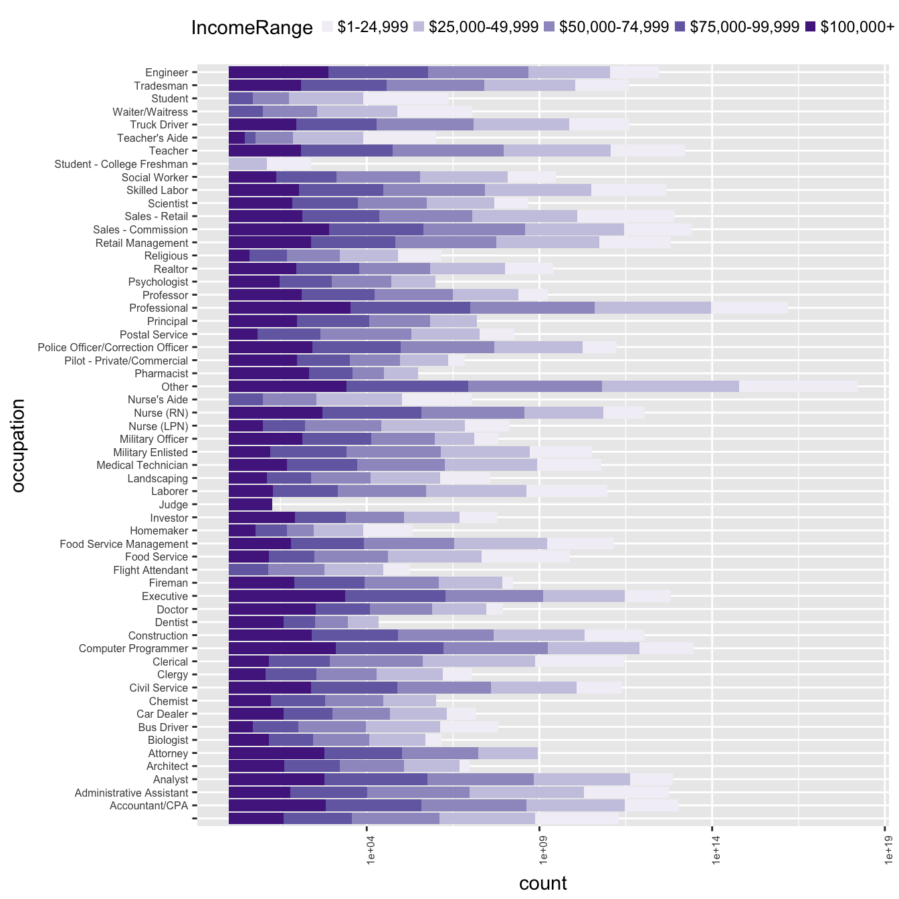

Loans exploration 
by Kirill Zayets

========================================================

If you were a banker whom you would not want to see among your customers ? Is there any connections between how much money do people earn and how likely they will not be able to make payments for their loans. Maybe the place where the one is living makes impact on his ability to pay on time? 


> # Summary of the data set


```
##  [1] "ListingKey"                         
##  [2] "ListingNumber"                      
##  [3] "ListingCreationDate"                
##  [4] "CreditGrade"                        
##  [5] "Term"                               
##  [6] "LoanStatus"                         
##  [7] "ClosedDate"                         
##  [8] "BorrowerAPR"                        
##  [9] "BorrowerRate"                       
## [10] "LenderYield"                        
## [11] "EstimatedEffectiveYield"            
## [12] "EstimatedLoss"                      
## [13] "EstimatedReturn"                    
## [14] "ProsperRating..numeric."            
## [15] "ProsperRating..Alpha."              
## [16] "ProsperScore"                       
## [17] "ListingCategory..numeric."          
## [18] "BorrowerState"                      
## [19] "Occupation"                         
## [20] "EmploymentStatus"                   
## [21] "EmploymentStatusDuration"           
## [22] "IsBorrowerHomeowner"                
## [23] "CurrentlyInGroup"                   
## [24] "GroupKey"                           
## [25] "DateCreditPulled"                   
## [26] "CreditScoreRangeLower"              
## [27] "CreditScoreRangeUpper"              
## [28] "FirstRecordedCreditLine"            
## [29] "CurrentCreditLines"                 
## [30] "OpenCreditLines"                    
## [31] "TotalCreditLinespast7years"         
## [32] "OpenRevolvingAccounts"              
## [33] "OpenRevolvingMonthlyPayment"        
## [34] "InquiriesLast6Months"               
## [35] "TotalInquiries"                     
## [36] "CurrentDelinquencies"               
## [37] "AmountDelinquent"                   
## [38] "DelinquenciesLast7Years"            
## [39] "PublicRecordsLast10Years"           
## [40] "PublicRecordsLast12Months"          
## [41] "RevolvingCreditBalance"             
## [42] "BankcardUtilization"                
## [43] "AvailableBankcardCredit"            
## [44] "TotalTrades"                        
## [45] "TradesNeverDelinquent..percentage." 
## [46] "TradesOpenedLast6Months"            
## [47] "DebtToIncomeRatio"                  
## [48] "IncomeRange"                        
## [49] "IncomeVerifiable"                   
## [50] "StatedMonthlyIncome"                
## [51] "LoanKey"                            
## [52] "TotalProsperLoans"                  
## [53] "TotalProsperPaymentsBilled"         
## [54] "OnTimeProsperPayments"              
## [55] "ProsperPaymentsLessThanOneMonthLate"
## [56] "ProsperPaymentsOneMonthPlusLate"    
## [57] "ProsperPrincipalBorrowed"           
## [58] "ProsperPrincipalOutstanding"        
## [59] "ScorexChangeAtTimeOfListing"        
## [60] "LoanCurrentDaysDelinquent"          
## [61] "LoanFirstDefaultedCycleNumber"      
## [62] "LoanMonthsSinceOrigination"         
## [63] "LoanNumber"                         
## [64] "LoanOriginalAmount"                 
## [65] "LoanOriginationDate"                
## [66] "LoanOriginationQuarter"             
## [67] "MemberKey"                          
## [68] "MonthlyLoanPayment"                 
## [69] "LP_CustomerPayments"                
## [70] "LP_CustomerPrincipalPayments"       
## [71] "LP_InterestandFees"                 
## [72] "LP_ServiceFees"                     
## [73] "LP_CollectionFees"                  
## [74] "LP_GrossPrincipalLoss"              
## [75] "LP_NetPrincipalLoss"                
## [76] "LP_NonPrincipalRecoverypayments"    
## [77] "PercentFunded"                      
## [78] "Recommendations"                    
## [79] "InvestmentFromFriendsCount"         
## [80] "InvestmentFromFriendsAmount"        
## [81] "Investors"
```

```
## [1] 113937
```

We have 113937 rows of loans made across US. Each row divided into 81 columns. Since given data describes loans it would be beneficial to understand how it is distributed geographically over states.


We are seeing that more or less all the states are represented and one state stands out having 2 times more data than the one next to it. So peak here is CA which stands for California. Also one thing to mention there are more than 5000 rows that don't belong to any state. 1/3 of the data came from *four* states : CA, TX, NY, FL. If we look at population rank we would see same picture. Most populated states are CA, TX, NY, FL and next one is IL. That corresponds to the given data.


There were many missing rows in variety of columns so I decided to remove them and rewrite data. Lets take a look at income ranges.


```
##             $0      $1-24,999      $100,000+ $25,000-49,999 $50,000-74,999 
##            603           7040          17175          31520          30638 
## $75,000-99,999  Not displayed   Not employed 
##          16737           3928            781
```

603 customers did not report any income and 781 stated unemployment. We are suspicious about these customers being loan takers. We will investigate them a bit later but for now lets just look at distribution and re-organised order of layers.


25k-50k range takes first place, 50k-75k takes second. 

Lets look at those with income range __$0__ whether that was a mistake or data simply was not collected. It seems like all these clients were employed and apparently data itself is good but we don't know their income level for some reason, so we want to keep these rows for other questions which may emerge, such as how come that people with 0 income were given a loan? None of them stated any income. Lets check the loan origination date to understand maybe it was introduced due to merge with old data.


```
##      LoanStatus     Occupation EmploymentStatus IncomeRange
## 79   Chargedoff        Realtor        Full-time          $0
## 109   Completed      Executive        Full-time          $0
## 773   Completed          Other        Full-time          $0
## 955   Completed      Principal        Full-time          $0
## 1347  Completed Sales - Retail    Self-employed          $0
##      IncomeVerifiable StatedMonthlyIncome LoanOriginationDate
## 79              False                   0 2008-07-08 00:00:00
## 109             False                   0 2008-05-09 00:00:00
## 773             False                   0 2008-04-15 00:00:00
## 955             False                   0 2008-04-24 00:00:00
## 1347            False                   0 2007-12-24 00:00:00
```
So stated income is 0 but status in most cases full-time or so. Let see into the dates rows had been created maybe it was long ago and no one bothered about collecting incomes.


```
## [1] "2007-05-30"
```

```
## [1] "2013-09-10"
```
We checked that range of dates encountered comprised of not only "old" dates but also of pretty "fresh" e.x 2013. So more and more it looks like the data we are not going to use.

The second suspicious group is "Not employed". There were a few who being "unemployed"" stated some monthly income. But overall outcome is same as in previous step.


```
##     LoanStatus Occupation EmploymentStatus  IncomeRange IncomeVerifiable
## 67   Completed      Other     Not employed Not employed             True
## 101 Chargedoff      Other     Not employed Not employed            False
## 126    Current      Other     Not employed Not employed            False
## 171  Completed      Other     Not employed Not employed            False
## 187 Chargedoff      Other     Not employed Not employed            False
##     StatedMonthlyIncome LoanOriginationDate
## 67                  860 2007-04-17 00:00:00
## 101                   0 2013-01-30 00:00:00
## 126                   0 2011-05-26 00:00:00
## 171                   0 2012-04-17 00:00:00
## 187                   0 2012-02-16 00:00:00
```

I think time has come to get rid of data with $0, unemployed, NA values from data set. It does not look like this data could help us to find anything interesting at this stage. Lets remove and adjust factor levels.


The plot above shows distribution over 5 income ranges. Taking into consideration that group 100+ potentially could consist of many other levels we could say that plot is skewed right with long tail in the end.
    

# Univariate Plots Section

Let see what occupations are among borrowers and their income level. There are 68 layers presented. We could combine several similar occupations into one group e.x "Student - College Freshman","Student - College Graduate Student" "Student - College Junior", "Student - College Senior", "Student - College Sophomore", "Student - Community College", "Student - Technical School"


Top 3 categories from occupation columns are Other, Professional and Computer Programmer/Executive. To see distribution in more details I applied log scale since "Other" bar had more than 30k rows when the next one only ~13k.

We are going to need more patterns/dependencies to get everything together. Lets dig into amount of loans taken.


It appears the most popular loan is 4k, second 10k and third 15k respectively. Going further we may decide to combine amounts by levels to avoid dispersion. Loans of amount greater than 25k treated as outliers. It is not usual amount for loan and we are going to see distribution over different income ranges.
Now we are going to separate loans by income levels.


It is interesting to notice that first three distributions look very similar almost a like. The greatest loan taken in these groups somewhat about ~25k. Only those who earn 100+k has loans greater that 25k.


We noticed here the number of outliers in one category (1-25k). With that low income number of people were given loans greater than ~12k up to 25k. Even with top income in this group (25k) loan for 25k looks very strange. Each jump in range coming along with jump in loans means. Interesting that in group 100k+ mean of taken loans less than in other groups. The broader interquartile range is in group within 75k-100k.


```r
filter(loan_df, IncomeRange == "$1-24,999" & LoanOriginalAmount > 10000 ) %>%
  select(IncomeRange, CreditScoreRangeLower,LoanOriginalAmount, 
         Occupation, LoanStatus, IsBorrowerHomeowner, StatedMonthlyIncome, 
         Recommendations) %>% 
  group_by(LoanStatus) %>% 
  summarise(n=n(), meanCC=mean(CreditScoreRangeLower))
```

```
## # A tibble: 9 x 3
##               LoanStatus     n   meanCC
##                   <fctr> <int>    <dbl>
## 1             Chargedoff    75 704.8000
## 2              Completed    87 710.8046
## 3                Current   115 718.9565
## 4              Defaulted    28 701.4286
## 5   Past Due (1-15 days)     1 640.0000
## 6  Past Due (16-30 days)     1 740.0000
## 7  Past Due (31-60 days)     1 700.0000
## 8  Past Due (61-90 days)     2 700.0000
## 9 Past Due (91-120 days)     1 620.0000
```

Looks like they had not that bad credit score but anyway group of defaulted and charged off customers quite big comparing with amount of those who completed. I would keep this data in analysis and even in future would specifically in this group with IncomeRange 1-25k.

  

  Almost half of cases is still in progress. We will combine all past due groups into two: <30days and  >30 days.
  
  


Number of credit lines appears to be with long right tail. Credit scores usually lie in range ~500 - 850. Here we see outliers in 0 point.


```r
filter(loan_df, CreditScoreRangeLower == 0) %>% 
  select(IncomeRange, CreditScoreRangeLower, CreditScoreRangeUpper, OpenCreditLines)
```

```
## [1] IncomeRange           CreditScoreRangeLower CreditScoreRangeUpper
## [4] OpenCreditLines      
## <0 rows> (or 0-length row.names)
```
Data seems to be good but kind of old, almost all rows dated as 2005-2007. Income range "Not displayed" and upper credit range set to 19. OpenCreditLines for all the rows set to NA. 133 rows in total. I am going to delete that data.


There are few outliers whose APR around ~0.5. 


# Univariate Analysis

### What is the structure of your dataset?
  
  There are **113.937k** in data set with 81 columns. I have chosen *11* features for analysis in a first place : 
  
  * __LoanOriginalAmount__ - integer amount of taken loan.
  
  * __IncomeRange__ - factor with 7 levels: 0, 0-25k, 25-50, 50-75, 75-100, 100+, NA.
  
  * __LoanStatus__ - factor with 14 levels: Cancelled, Chargedoff, Completed, Current, Defaulted, FinalPaymentInProgress, PastDue of 6 types.
  
  * __Occupation__ - factor 71 levels
  
  * __BorrowerState__ - factor 52 levels, 50 + Empty, NA.
  
  * __BorrowerAPR__ - The Borrower's Annual Percentage Rate (APR) for the loan.
  
  * __CreditScoreRangeLower__ - The lower value representing the range of the borrower's credit score as provided by a consumer credit rating agency.
  
  * __CurrentCreditLines__ - Number of current credit lines at the time the credit profile was pulled.
  
  * __DelinquenciesLast7Years__ - Number of delinquencies in the past 7 years at the time the credit profile was pulled.
  
  * __Term__ - The length of the loan expressed in months.
  
  * __MonthlyLoanPayment__ - The scheduled monthly loan payment.
  
  
  **Observations:**
  
  > Credit score range and current credit lines do follow "normal"" distribution.
  Top 3 categories from occupation columns are Other, Professional and Computer Programmer/Executive.
  We are seeing that more or less all the states are represented and one state stands out having 2 times more data than the one next to it. So peak here is CA which stands for California. Also one thing to mention there are more than 5000 rows that don't belong to any state. 1/3 of the data came from *four* states : CA, TX, NY, FL. If we look at population rank we would see same picture. Most populated states are CA, TX, NY, FL and next one is IL. That corresponds to the given data.
  25k-50k income represented more than others, 50k-75k takes second place. 
  It appears the most popular loan is 4k, second 10k and third 15k respectively. 
  There was a group of outliers with amount 25k and higher.
  The greatest loan taken in these groups somewhat about ~25k. Only those who earn 100+k has loans greater that 25k.
  We noticed here the number of outliers in one category (1-25k). With that low income number of people were given loans greater than ~12k up to 25k.
  Even with top income in this group (25k) loan for 25k looks very strange. Each jump in range coming along with jump in loans means. Interesting that in group      100k+ mean of taken loans less than in other groups.
  The broader interquartile range is in group within 75k-100k.	
  
### What is/are the main feature(s) of interest in your dataset?
The main features in data set are failures to return debt (LoanStatus), IncomeRange, LoanAmount, CreditScore, CurrentCreditLines. I would like to determine which features have great impact on inability to return debt in time.

### What other features in the dataset do you think will help support your \
investigation into your feature(s) of interest?

I think probably Occupation, BorrowerState, BorrowerAPR, DelinquenciesLast7Years, Term, MonthlyLoanPayment also contribute to successful or maybe not collaboration with banks/borrowers.

### Did you create any new variables from existing variables in the dataset?

I created freq var to track % of LoanStatus in each state.

### Of the features you investigated, were there any unusual distributions? \
Did you perform any operations on the data to tidy, adjust, or change the form \
of the data? If so, why did you do this?

Transformed IncomeRange to exclude NA, Not Employed and to re-order levels.
Transformed several occupations(different types of students, engineers) in one group.
Removed customers with $0 income.
Introduced two levels "Past Due < 30" and "Past Due >30" instead of six.
Combined loans amount into 7 groups to avoid dispersion and use levels instead of hundreds different integers.
Applied squared root transformation to zoom more in data of IncomeRanges and LoanAmount.

# Bivariate Plots Section

Now the idea is to look at charts from previous section once again but this time adding new dimensions (colors).



There are not so many guys who earn less than 25k compared to others and even more strange they are not widely represented as loan takers. I expected the less your income is the more you loan from bank. That level (1-25) is rarely seen among specialists because it's expected they earn more than that.. of course. less than 25k is more common for students. There is group of students with 75k-100k income range. Also there is noticeable part of those who has more than 100k and still borrows "micro loans". Lets recall that max loan amount is 35k and it's third part of year salary for those people. Now it worth looking at loan status to understand which group has most problems with returning loans back and also we are going to zoom in to see distribution over small groups.


<!-- -->

From the chart above we are seeing that the group where most "defaulted" borrowers are from is the one with income range $25k-50k$. Same stands for "Charged-off" group. Among defaulted persons we clearly see that 75+, 100+ ranges have good representation as well.

Lets regroup "Past Due" statuses into two groups <30 and >30 days and look at statuses over states and failed statuses over states in particular.


It is hard to see pattern from first chart as data has skewness and to see more details we converting values into frequencies and plotting mean for each loan status over state. From top 5 states New York has better values of charged-off and defaulted groups. Wyoming has least of charged-off customers over all states that is opposite to Missouri with more than 30% of charged-off customers. Most % of completed loans is in Utah and least of Current. Lets filter out Completed and Current levels to see only "problematic" layers.


North Dakota, Montana, New Mexico, Rhode Island, Utah, Alabama, Kansas, Minnesota,Washington, Illinois all of them have somewhat like increased chances to meet "defaults"" working with customers. Lowest % in South Carolina.


Most risky income range interval is 25-50k.


In two groups we are observing exactly the same level of loan means (50-75, 75-100). In 3 others loan means in defaulted group is higher. Lets compare against completed loans.

50-75 range means are equal. All the others have the way greater amount of loans.

<!-- -->


We are interested in groups <5k, 5-10k as representatives of most "failed" cases. 10-15k moderate interest. Within 15-20k, 20-50k amount of failed customers quite low under 2.5% but for sake of curiosity in future we could look at group with income range 100+ as there this group goes beyond borders in mentioned ranges.


```
## Warning: attributes are not identical across measure variables;
## they will be dropped
```

```
##                  var  min      max       mean  median         sd     q25
## 1 LoanOriginalAmount 1000 35000.00 8635.92621 7000.00 6275.06896 4000.00
## 2 MonthlyLoanPayment    0  2251.51  280.64742  232.68  191.64407  141.02
## 3               Term   12    60.00   41.31603   36.00   10.81978   36.00
##        q75
## 1 12500.00
## 2   378.53
## 3    36.00
```

Maximum loan amount taken was 35k I expected it would be much higher. Probably the reason for loans was just "other needs" or to restructure other loans. For sure mortgage loans are not the part of this data. On average people pay ~280$ monthly and average Term is 41 month.
Next we are going to cut LoanOriginalAmount into several groups : 2,4,6,10,15,20,40k and figure out how these levels are related to Borrower APR.


This is strange to me but it doesn't look like APR value depends on IncomeRange. Above we see all layers in different APR categories. I would expect the lower income range is the greater APR value should be. If we introduce loan amount ranges we will see that the greater loan amount is the lower APR customer has which is.. make sense. We see layers getting more and more to the right once loan amount getting lower and lower. So there is a dependency.

Lets introduce last vars I wanted to look at - DelinquenciesLast7Years, CurrentCreditLines and CreditScoreRangeLower.


Data appears to be super right skewed since 65k customers did not have any delinquencies which is expected. Funny thing there is an outlier at x - 99 that means among customer you could find the ones with that many (~99) minor crimes(debt not paid in time ) committed. Lets zoom in and we see that there are many more others but why does it have local peak at 99-100? Taking closer look to layers below 800 reveals that amount of delinquencies don't have great impact on how often customers getting defaulted and charged-off. On the range between 0 and 30 there is visible amount of defaulted customers but trends getting lower as delinquencies grows. 

Excluding "Current" level as the biggest one to see others. Here is CurrentCreditLines colored with Loan statuses. 


Defaulted zone is in range 0-20 mostly. Distribution follows normal pattern with skeweness to right side. 


```
##       mean median
## 1 9.648366      9
```

I am excluding "Current" level and converting values into frequencies.


Lets look into different pairs of features we have selected for analysis.

<!-- -->

From a subset of the data , LoanOriginalAmount correlates with MonthlyPayment that was clear without any plots =).
There is moderate correlation between BorrowerAPR and CreditScoreRangeLower and BorrowerAPR and LoanOriginalAMount. The others don't have any meaningful numbers. It looks like we don't have anything to build model on. Many of selected data is categorical.. we are going to need more insights.

Maybe filtering out all positive cases will somehow help us to understand what is happened to failed customers.
We are looking at box-plots of "problematic" groups. To have something to compare against we are going to see how customer who completed their loans behave.


It doesn't look dramatically different to base our prediction on. Grouping by IncomeRange reveals growing trend: the higher income one has the more money he/she loans, more credit lines he/she has opened, more he/she pays monthly. Biggest monthly payments have been in 100+ group. I cant say we did not expect that but for sake of curiosity we did confirm that once again. Second we have built "failed" customers also divided by groups and same trend there.


There are only two groups we selected as most interesting for us "defaulted" and "charged-off". Same growing trend here as well and inter quartile range is broader for "defaulted" group than for "charged-off" one.
In each group customers from "defaulted" group had more opened credit lines than from "charged-off" and also they had bigger loan original amount.


Range of loans for "defaulted" group is wider then for "charged-off" and "completed" groups.

<!-- -->

We have already seen that from numbers that max loan amount is 35k. What additionally we could pick up from the chart above is confirmation of importance of CreditScore. As Score grows Loan Amount getting higher as well. There are no customers with score lower than 700 and loan taken more than 25k. Big loan requires big score. We are seeing each 5k in loans requires movement in credit score. Based on quartiles we could split scores into 5 sections: 500-590, 590-670, 670-750, 750-860, 860-900 where 90% of customers belong to. 


```
## 
## 	Pearson's product-moment correlation
## 
## data:  loan_df$LoanOriginalAmount and loan_df$CreditScoreRangeLower
## t = 113.44, df = 103110, p-value < 2.2e-16
## alternative hypothesis: true correlation is not equal to 0
## 95 percent confidence interval:
##  0.3276576 0.3385107
## sample estimates:
##       cor 
## 0.3330952
```

Meaningful but small correlation 0.33 found. 


```
## 
## 	Pearson's product-moment correlation
## 
## data:  failed_loans$LoanOriginalAmount and failed_loans$CreditScoreRangeLower
## t = 55.606, df = 12874, p-value < 2.2e-16
## alternative hypothesis: true correlation is not equal to 0
## 95 percent confidence interval:
##  0.4260401 0.4538972
## sample estimates:
##       cor 
## 0.4400745
```

The better numbers of correlation found here only for failed loans. Will be looking into them. 

# Bivariate Analysis

### Talk about some of the relationships you observed in this part of the \
investigation. How did the feature(s) of interest vary with other features in \
the data set?
  
  There is moderate correlation between BorrowerAPR and CreditScoreRangeLower and BorrowerAPR and LoanOriginalAMount.
  If we introduce loan amount ranges we will see that the greater loan is the lower APR customer given.

  > a) From State to State number of loans with problems (defaulted, prolonged, charged-off) doesn't fluctuate much and it was about __10-12% on average__. From top 5 states New York has better/lower values of charged-off and defaulted groups. Wyoming has least of charged-off customers over all states. Most % of completed loans is in Utah. North Dakota, Montana, New Mexico, Rhode Island, Utah, Alabama, Kansas, Minnesota,Washington, Illinois all of them have somewhat like increased chances to meet "defaulted" customers. I found 5000 rows which don???t belong to any state. 1/3 of the data came from 3 four states : CA, TX, NY as most populated states.
  > b) Most of loans taken by customer __with income range 25-50k__. Second place take the ones with income 50-75k. __The most "defaulted" borrowers are those with income range $25k-$40k__. Same stands for "Charged off" group. Maximum loan amount taken was 35k. It appears the most popular loan is *4k, second 10k and third 15k respectively*. Only those who earn 100+k has loans greater that 30k. Greatest percentage (7-12.5%) of "charged-off" customers were in group where income belongs to 25-40k range and loan taken not above 7.5k. Same goes for "defaulted" group (~1.25%). Second next group with income range 50-75k.
  
  > c) Occupation for most of customers set to ???Other???, second popular was ???Professional??? and 2 next were ???Computer Programmer??? and ???Executive???. 1-25k very rarely seen among loan takers. 100+k well presented across many specialties. There were 603 rows and 781 rows of either Not employed or with $0 income. Strange customers for bank or just errors. Among customer you could find the ones with ~99 minor crimes (debt not paid in time ) committed.
  

### Did you observe any interesting relationships between the other features \
(not the main feature(s) of interest)?

Grouping by IncomeRange reveals growing trend: the higher income one has the more money he/she loans, more credit lines he/she has opened, more he/she pays monthly. I cant say we did not expect that but for sake of curiosity we did confirm that once again. "Failed" customers divided by groups (there are only two groups we selected as most interesting for us "defaulted" and "charged-off") reveals same growing trend and inter quartile range was broader for "defaulted" group than for "charged-off" one. In each IncomeRange group customers from "defaulted" group had more opened credit lines than from "charged-off" and also they had bigger loans. 
We have already seen that max loan amount is 35k. What additionally we picked up from analysis was confirmation of CreditScore importance. As Score grows Loan Amount getting higher as well. There were no customers with score lower than 700 and loan taken more than 25k. Big loan requires big score. We were seeing each 5k in loans required movement in credit score. Based on quartiles we could split scores into 5 sections: 500-590, 590-670, 670-750, 750-860, 860-900 where 90% of customers belong to. 

### What was the strongest relationship you found?

So far it has been LoanOriginalAmount and CreditScoreRangeLower with correlation ~ 0.44. And of course MonthlyLoanPayment and LoanAmount =) ~ 0.93.


# Multivariate Plots Section


Within credit score range 500-700 **50%** of problems happened to loans below 5k.
Within credit score range 600-650 **90%** of problems happened to loans below 10k. Once ~750 credit score range crossed the number of "charged-off" becomes much lower and we started to see "defaulted" group more clearly. The interval below 10k for loan amount and up to 750 for credit score comprised of most data.
Just to recall most popular loans were 4k, 10k, 15k.

Lets split "failed" loans into ranges corresponding to IncomeRange feature.


25-50k and 50-75k are most saturated areas. Problem loans are rarely seen for credit score above 800 in all groups.


Almost the same idea as for "defaulted" group depicted for "charged-off" but number of cases is the way more. Lets reverse idea and face-wrap by LoanStatus.


Customers with income range 100+ are rarely got to the "charged-off" group. For "charged-off" group most of loans were under 15k. Also there were loans given to customers with score below 600 which is not he case for "Current" group where we see only loans for customers with credit score above ~580. Only rich (100+k) "current" borrowers are on the top of loan amount distribution with loans 25k+. I see that data mostly concentrated within several levels like 0-5,5-10,10-15,15+ and keeping in mind most popular loans were 4, 10, 15 I would re-arrange loan original amount levels. Also i am introducing freq column to see trend in % rather then numbers.


We grouped data on several columns: LoanAmountShort, LoanStatus, IncomeRange, CreditScoreShort. Lets now plot several facet wraps to understand whether it helps converting data this way. First plot depicts means of credit score for several statuses like "charged-off", "completed", "defaulted" and everything is split into several levels based on loan amount (5,10,15,20,25k). Also data has been grouped on IncomeRange.


Here we found several interesting patterns (I know it's a bit overloaded :) 
  a. % of "defaulted" group greatly increases within loan range 15-20 for credit score range 650-670 and IncomeRange group 1-25k.
  b. There are no cases in which: "defaulted", "charged-off" groups intersect 780 credit score threshold. 
  c. % of "charged-off" greatly increases within loan range 10-15k and 700-710 credit score range.
  d. Looks like most problems (peaks of defaulted and charged-off) belong to 670-750 credit range. 
  e. Group with lowest income range 1-25k got most of defaulted cases in two highest loans ranges (15-20k and 20-50k).
  
  Lest clear the picture a bit.


To the previous findings we could add that customers with top income 100k+ were defaulted most than others within loan range 670-750 and loan amount 10-15k.


```r
theme.set(p_ch, "Credit score range [points]", "Frequency [%]", legend_pos = "top")()
```

<!-- -->

```r
theme.set(p_def, "Credit score range [points]", "Frequency [%]", legend_pos = "none")()
```

<!-- -->

Most problem credit range is again near 700 within loan range 10-15k for all income ranges but especially for the 75-99k.

# Multivariate Analysis

### Talk about some of the relationships you observed in this part of the \
investigation. Were there features that strengthened each other in terms of \
looking at your feature(s) of interest?

I looked into different loan statuses and found that there has been some discrepancies on how data distributed over IncomeRange layers.  As we defined previously CreditScore also affects customers from different groups. Within credit score range 500-700 **50%** of problems happened to loans below 5k. Within credit score range 600-650 **90%** of problems happened to loans below 10k.  Once ~750 credit score range crossed the number of "charged-off" becomes much lower and we started to see "defaulted" group more clearly. The interval below 10k for loan amount and up to 750 for credit score comprised of most data.
Problem loans are rarely seen for credit score above 800 in all groups.
Customers with income range 100+ are rarely got to the "charged-off" group. For "charged-off" group most of loans were under 15k.
Also there were loans given to customers with score below 600 which is not he case for "Current" group where we see only loans for customers with credit score above ~580. Only rich (100+k) "current" borrowers are on the top of loan amount distribution with loans 25k+. 


### Were there any interesting or surprising interactions between features?

I saw that data mostly concentrated within several levels like 0-5,5-10,10-15,15+ and keeping in mind most popular loans were 4, 10, 15 I re-arranged loan original amount levels. Also I did introduce freq column to see trend in % rather then numbers.
We grouped data on several columns: LoanAmountShort, LoanStatus, IncomeRange, CreditScoreShort and split into several levels based on loan amount (5,10,15,20,25k).
Here we found several interesting patterns: 
  a. % of "defaulted" group greatly increases within loan range 15-20 for credit score range 650-670 and IncomeRange group 1-25k.
  b. There were no cases in which: "defaulted", "charged-off" groups intersected 780 credit score threshold. 
  c. % of "charged-off" greatly increases within loan range 10-15k and 700-710 credit score range.
  d. Looks like most problems (peaks of defaulted and charged-off) belong to 670-750 credit range. 
  e. Group with lowest income range 1-25k got most of defaulted cases in two highest loans ranges (15-20k and 20-50k).
  f. Customers with top income 100k+ were defaulted most than others within loan range 670-750 and loan amount 10-15k.
  g. Most problem happened to customers with credit range near 700 within loan range 10-15k to all income ranges but especially for the 75-99k.


### OPTIONAL: Did you create any models with your dataset? Discuss the \
strengths and limitations of your model.
I did not find enough of features to build model on.

------

# Final Plots and Summary


### Plot One


### Description One

  Above depicted each state from data set and its mean in percents for each loan group. The reason for this plot was to see how different percentage of "failed or completed" loans could be in variety of states. Potentially we could have continued looking at state population, average state income, geography and so on but we stopped at this point where we see fluctuation per state. 

### Plot Two


<!-- -->

### Description Two
  
  Here we are taking a look at pre-selected groups (charged-off and defaulted) over 5 income ranges. Idea was to find if there is a group where possibility of being "defaulted" or "charged-off" is higher than in others groups. We found that group and it is 25k-50k. Amount of "charged-off" customers in this group twice as high as for the next one. Also two most interesting groups in terms of "failed" customers are 25k-50k and 50k-75k. 

### Plot Three


### Description Three

  Here we grouped data on several columns: LoanAmountShort, LoanStatus, IncomeRange, CreditScoreShort and split into several levels based on loan amount (5,10,15,20,25k). So now we know credit score/ loans amount/income range buckets in which we could expect more problems happened than in other ones. Most of problems happened to customers with credit range near 700 within loan range 10-15k to all income ranges but especially for the 75-99k.

------

# Reflection

To me it was surprising seeing data in provided format knowing that is a "bank" data. Many rows were populated with nulls, missing values, zeros, etc. Most of features are categorical ones and it is hard to find relations and calculate coefficient (~~apparently it is me who doesn't know how to use that~~). I selected up to 10 features crucial for loan givers. Lots of missing "occupation" and "real income" values so that makes these fields almost meaningless to me but in reality those should be very important. After several steps made I decided  to go with those I selected for analysis and started combining different categories with only 2 or 3 numerical features. I looked into different states and found that there were several outstanding states in terms of completed and non completed loans. Then I decided to continue analysis of discrepancies in IncomeRange features and found that people in different groups behave differently. The more money the one earns the more he/she loans from bank. That was also strange looking to me. I found that the most problematic group was the one with 25-50k range in salaries and most of charged-off customers belong to it. Loans seemed to be very dispersed so I combined them by levels of their popularity (up to 5k, 10k, 15k, 20k, 20+k). It gave clear picture again of most problematic zones. Looking at credit score ranges i found there was a jump in credit score each 5k or so. That lead me to the idea of combining credit score ranges, loans amount and income ranges together to see picture in detail on each interval. I spit grouped data over LoanStatuses to see what is happening there as well. It appeared the greatest amount of problems were nearly 700 credit score zone almost for all represented loans ranges and income groups. I did not build any model because I did not look at other features presented and that model likely would not be good one and as a matter of fact I don't know how to build one yet to predict possibility of failure for individual.

## Found facts (copied from above):

#### States

* From top 5 states New York has better values of charged-off and defaulted groups.
* Wyoming has least of charged-off customers over all states.
* North Dakota, Montana, New Mexico, Rhode Island, Utah, Alabama, Kansas, Minnesota,Washington, Illinois all of them have somewhat like increased chances to meet "defaulted" customers.

#### Income Range

* Most of loans taken by customer with income range 25-50k.
* The most "defaulted" borrowers are those with income range $25k-$40k.
* Only those who earn 100+k has loans greater that 30k.
* Group with lowest income range 1-25k got most of defaulted cases in two highest loans ranges (15-20k and 20-50k).
* Customers with income range 100+ are rarely got to the "charged-off" group.

#### Loan

* Maximum loan amount taken was 35k
* It appears the most popular loan is 4k, second 10k and third 15k respectively.
* The greater loan is the lower APR customer given.
* Big loan requires big score.

#### Credit Score

* Credit Score range and CurrentCreditLines do follow "normal" distribution.
* As Score grows Loan Amount getting higher as well.
* Most of problems (peaks of defaulted and charged-off) belong to 670-750 credit range.

#### Mixed

* Greatest percentage (7-12.5%) of "charged-off" customers were in group where income belongs to 25-40k range and loan amount under 7.5k.	
* There were no customers with score lower than 700 and loan taken greater than 25k.
* % of "defaulted" group greatly increases within loan range 15-20 for credit score range 650-670 and IncomeRange group 1-25k.
* % of "charged-off" greatly increases within loan range 10-15k and 700-710 credit score range.
* Among customer you could find the ones with ~99 minor crimes (debt not paid in time ) committed.
